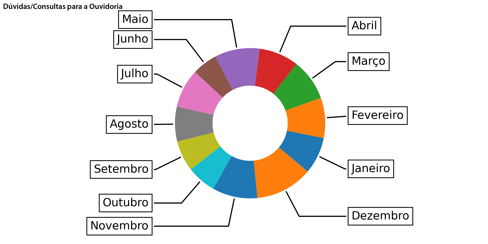

# DATA VISUALIZATION / VISUALIZAÇÃO DE DADOS
**PORTUGUESE / PORTUGUÊS:** Programa desenvolvido durante meu estágio como designer multimídia no Tribunal Regional do Trabalho da 7º Região. Fui solicitado para criar alguns gráficos baseados em uma tabela do Google Sheets e resolvi utilizar Python para automatizar o processo.

**ENGLISH / INGLÊS:** Program developed during my multimedia design internship at Tribunal Regional do Trabalho da 7ª Região. I was asked to make some charts based on a Google Sheet's table and i used Python to automate the process.

## **Description / Descrição**:
**PORTUGUESE / PORTUGUÊS:** Há três funções no arquivo python, a <ins>get_num</ins> que lida com os valores de entrada, a função <ins>main</ins> e a <ins>create_chart</ins>, que é onde está o código presente na documentação do **matplotlib**. Eu carrego o arquivo .csv para a memória e extraio e limpo os dados que desejo utilizar. Após isto utilizo a função <ins>create_chart</ins> para gerar o arquivo .png com o gráfico e, depois, utilizo a biblioteca **PIL** para inserir o título na imagem com a fonte desejada. 

**ENGLISH / Inglês:** There is 3 functions on the python file, the <ins>get_num</ins> that deals with input values, the <ins>main</ins> function and the <ins>create_chart</ins> one, which is where the **matplotlib** code is. I load the .csv file into memory and extract and clean the data that i want. After that i use the <ins>create_chart</ins> function to generate the .png file containing the chart and then i use the **PIL** library to add the title on the .png with the font that i want.

## **Output Example / Exemplo de Saída**:

